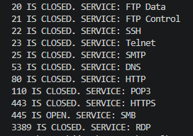
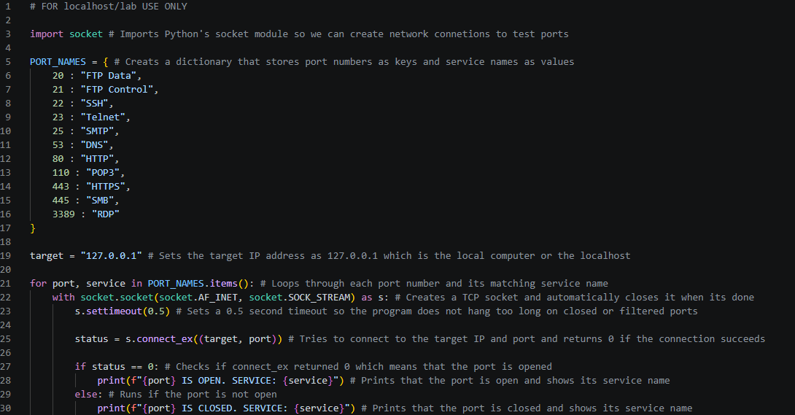

# Python Port Scanner

## Overview

This project is a simple TCP port scanner built with Python. The script checks a list of common network ports on a target machine and reports whether each port is open or closed.

The purpose of this project is to practice basic Python scripting, socket programming, and network service identification in a controlled lab environment.

## Project Objective

The objective of this lab was to create a beginner-friendly port scanner that can:

- Connect to a target host
- Check common TCP ports
- Identify whether each port is open or closed
- Display the service commonly associated with each port
- Practice safe and legal network scanning concepts

## Tools Used

- Python
- Visual Studio Code
- Python `socket` module
- Localhost testing environment

## How It Works

The script uses Python's built-in `socket` module to attempt TCP connections to common ports on the target system.

If the connection succeeds, the port is reported as open. If the connection fails or times out, the port is reported as closed.

The current target is:

```python
target = "127.0.0.1"
```

`127.0.0.1` refers to the local machine, also known as localhost. This keeps the scan limited to the user's own computer.

## Ports Scanned

| Port | Common Service |
|---:|---|
| 20 | FTP Data |
| 21 | FTP Control |
| 22 | SSH |
| 23 | Telnet |
| 25 | SMTP |
| 53 | DNS |
| 80 | HTTP |
| 110 | POP3 |
| 443 | HTTPS |
| 445 | SMB |
| 3389 | RDP |

## Screenshots

### Port Scanner Output



### Port Scanner Code



## Example Output

```text
20 IS CLOSED. SERVICE: FTP Data
21 IS CLOSED. SERVICE: FTP Control
22 IS CLOSED. SERVICE: SSH
23 IS CLOSED. SERVICE: Telnet
25 IS CLOSED. SERVICE: SMTP
53 IS CLOSED. SERVICE: DNS
80 IS CLOSED. SERVICE: HTTP
110 IS CLOSED. SERVICE: POP3
443 IS CLOSED. SERVICE: HTTPS
445 IS OPEN. SERVICE: SMB
3389 IS CLOSED. SERVICE: RDP
```

## How to Run

1. Clone the repository:

```bash
git clone https://github.com/jadento7/python-security-labs.git
```

2. Navigate to the project folder:

```bash
cd python-security-labs/01-port-scanner
```

3. Run the script:

```bash
python src/port_scanner.py
```

## Project Structure

```text
01-port-scanner/
├── README.md
├── src/
│   └── port_scanner.py
└── screenshots/
    ├── 01-port-scanner-output.png
    └── 02-port-scanner-code.png
```

## What I Learned

Through this project, I learned how basic port scanning works at a high level. I practiced creating TCP socket connections, setting connection timeouts, looping through multiple ports, and mapping port numbers to common services.

This project also helped reinforce why open ports matter in cybersecurity. Open ports can indicate active services running on a system, which is useful for both network administration and security assessment.

## Future Improvements

Possible improvements for this project include:

- Allowing the user to enter a target IP address
- Allowing the user to choose a custom port range
- Adding better error handling
- Saving scan results to a text file
- Adding command-line arguments with `argparse`

## Security and Ethics Notice

This project is for educational use only. The scanner is configured to test `127.0.0.1`, which means it scans the local machine only.

Port scanning should only be performed on systems that you own or have explicit permission to test. Unauthorized scanning of public networks, companies, schools, or other people's devices is not appropriate.
