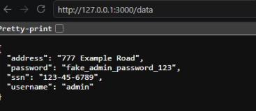
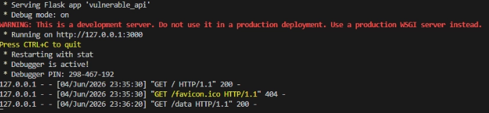
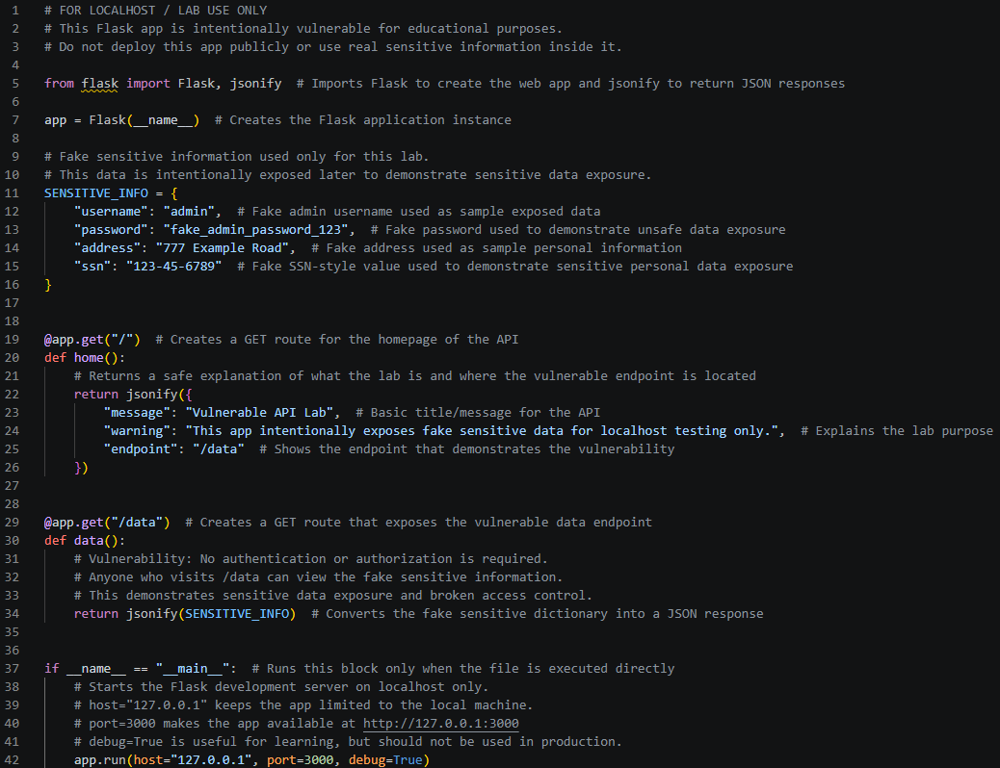

# Vulnerable API Lab

## Overview

This project is a beginner-friendly vulnerable API lab built with Python and Flask. The application intentionally exposes fake sensitive information through an unauthenticated API endpoint.

The purpose of this project is to demonstrate **sensitive data exposure** and **broken access control** in a safe localhost environment.

## Project Objective

The objective of this lab was to create a simple API that shows why sensitive data should not be exposed without proper authentication or authorization.

This lab demonstrates:

- How a basic Flask API works
- How JSON data is returned from an API endpoint
- How sensitive data exposure can happen
- Why authentication and authorization are important
- How to safely document vulnerable behavior in a controlled lab

## Tools Used

- Python
- Flask
- Visual Studio Code
- Localhost testing environment
- Web browser

## How the API Works

The application has two routes:

| Route | Purpose |
|---|---|
| `/` | Displays a basic homepage message and points users to the vulnerable endpoint |
| `/data` | Returns fake sensitive information without requiring authentication |

The `/data` endpoint is intentionally vulnerable because anyone who visits the endpoint can access the exposed data.

## Vulnerability Demonstrated

The main vulnerability in this lab is that the `/data` endpoint returns sensitive-looking information without checking who is requesting it.

```python
@app.get("/data")
def data():
    return jsonify(SENSITIVE_INFO)
```

There is no login, API key, token, role check, or authorization logic. This means the API exposes the data to anyone who can access the endpoint.

## Fake Sensitive Data Used

The exposed data is fake and used only for demonstration purposes:

| Field | Example Value |
|---|---|
| Username | admin |
| Password | fake_admin_password_123 |
| Address | 777 Example Road |
| SSN | 123-45-6789 |

No real personal information or real credentials were used in this project.

## Screenshots

### Sensitive Data Exposed



### Flask Server Running



### Vulnerable API Code



## How to Run

1. Clone the repository:

```bash
git clone https://github.com/jadento7/python-security-labs.git
```

2. Navigate to the project folder:

```bash
cd python-security-labs/02-vulnerable-api
```

3. Install Flask:

```bash
pip install -r requirements.txt
```

4. Run the application:

```bash
python src/vulnerable_api.py
```

5. Open the homepage in a browser:

```text
http://127.0.0.1:3000/
```

6. Open the vulnerable endpoint:

```text
http://127.0.0.1:3000/data
```

## Project Structure

```text
02-vulnerable-api/
├── README.md
├── requirements.txt
├── src/
│   └── vulnerable_api.py
└── screenshots/
    ├── 01-sensitive-data-exposed.png
    ├── 02-flask-server-running.png
    └── 03-vulnerable-api-code.png
```

## What I Learned

Through this project, I learned how to create a simple Flask API and return JSON responses from different routes.

I also learned why exposing sensitive data without authentication is dangerous. Even though this lab uses fake data, the same type of mistake in a real application could expose usernames, passwords, addresses, tokens, or other private information.

This project helped me understand the importance of access control, authentication, and secure API design.

## How This Could Be Improved

A safer version of this API could include:

- API key authentication
- Token-based authentication
- User login
- Role-based access control
- Environment variables for secrets
- Removal of sensitive data from API responses
- Better error handling

## Security and Ethics Notice

This project was created for educational purposes only. It runs on `127.0.0.1`, which means it is intended for localhost testing only.

The exposed information is fake and should not be used as real data. This project should not be deployed publicly. Vulnerable applications should only be created and tested in controlled lab environments.
