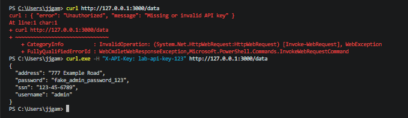
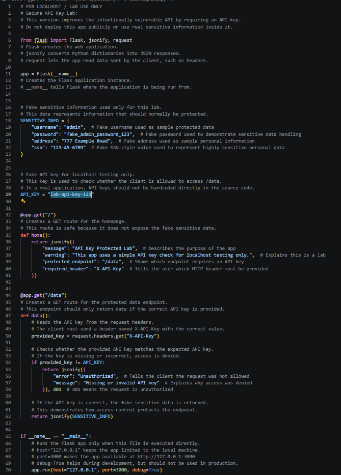
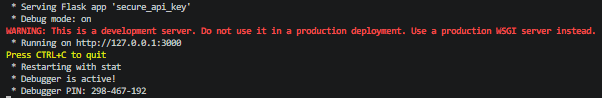

# API Key Protected API Lab

## Overview

This project is a beginner-friendly API security lab built with Python and Flask. It improves the earlier vulnerable API by requiring an API key before returning fake sensitive information.

The purpose of this lab is to demonstrate how a basic access control check can prevent unauthenticated users from viewing protected API data.

## Project Objective

The objective of this project was to modify a vulnerable API so that the `/data` endpoint no longer exposes information to anyone who visits it.

This lab demonstrates:

- Creating a Flask API
- Returning JSON responses
- Reading request headers
- Requiring an API key for access
- Returning a `401 Unauthorized` response when access is denied
- Testing API access with PowerShell and `curl.exe`

## Tools Used

- Python
- Flask
- Visual Studio Code
- PowerShell
- `curl.exe`
- Localhost testing environment

## How the API Works

The application includes two main routes:

| Route | Purpose |
|---|---|
| `/` | Displays basic information about the API and required header |
| `/data` | Returns fake sensitive data only when the correct API key is provided |

The required header is:

```text
X-API-Key: lab-api-key-123
```

## Security Improvement

The original vulnerable API exposed fake sensitive data without authentication. This improved version checks for an API key before returning the data.

```python
provided_key = request.headers.get("X-API-Key")

if provided_key != API_KEY:
    return jsonify({
        "error": "Unauthorized",
        "message": "Missing or invalid API key"
    }), 401
```

If the request does not include the correct API key, the API returns a `401 Unauthorized` response instead of exposing the data.

## Fake Sensitive Data Used

This lab uses fake information only:

| Field | Example Value |
|---|---|
| Username | admin |
| Password | fake_admin_password_123 |
| Address | 777 Example Road |
| SSN | 123-45-6789 |

No real personal information or real credentials were used.

## Screenshots

### API Key Access Test

This screenshot shows that accessing `/data` without an API key returns an unauthorized error, while using the correct API key returns the fake protected data.



### API Key Protected Code

This screenshot shows the Flask code that checks the `X-API-Key` request header before returning the protected data.



### Flask Server Running

This screenshot shows the Flask development server running locally on `127.0.0.1:3000`.



## How to Run

1. Clone the repository:

```bash
git clone https://github.com/your-username/python-security-labs.git
```

2. Navigate to the project folder:

```bash
cd python-security-labs/03-api-key-protected-api
```

3. Install the required package:

```bash
pip install -r requirements.txt
```

4. Run the Flask app:

```bash
python src/secure_api_key.py
```

5. Open the homepage in a browser:

```text
http://127.0.0.1:3000/
```

## How to Test

### Test without the API key

In PowerShell, run:

```powershell
curl http://127.0.0.1:3000/data
```

Expected result:

```json
{
  "error": "Unauthorized",
  "message": "Missing or invalid API key"
}
```

### Test with the API key

Use `curl.exe` so PowerShell does not treat `curl` as an alias:

```powershell
curl.exe -H "X-API-Key: lab-api-key-123" http://127.0.0.1:3000/data
```

Expected result:

```json
{
  "address": "777 Example Road",
  "password": "fake_admin_password_123",
  "ssn": "123-45-6789",
  "username": "admin"
}
```

## Project Structure

```text
03-api-key-protected-api/
├── README.md
├── requirements.txt
├── src/
│   └── secure_api_key.py
└── screenshots/
    ├── 01-api-key-access-test.png
    ├── 02-api-key-protected-code.png
    └── 03-flask-server-running.png
```

## What I Learned

Through this project, I learned how to protect an API endpoint using a simple API key check. I practiced reading HTTP request headers, returning proper error responses, and testing API behavior from PowerShell.

This project also helped me understand why access control matters. Without an access check, sensitive data can be exposed to anyone. With even a basic API key check, unauthorized requests can be blocked before the data is returned.

## Limitations

This project is still a beginner lab and is not production-ready.

Current limitations:

- The API key is hardcoded in the source code
- There is no user authentication system
- There is no logging or rate limiting
- The app uses Flask debug mode
- The API key is sent as a plain header

A stronger version would store the API key in an environment variable and avoid hardcoding secrets in the source code.

## Security and Ethics Notice

This project is for educational use only. It runs on `127.0.0.1`, which means it is intended for localhost testing only.

The data used in this project is fake. Do not use real credentials, personal information, API keys, tokens, or secrets in lab projects. Do not deploy intentionally vulnerable or experimental security labs publicly.
