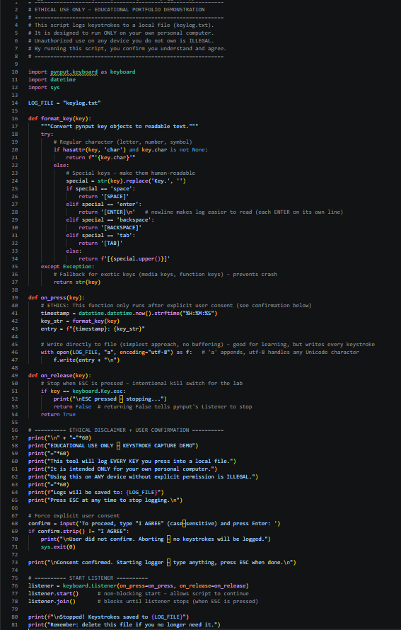
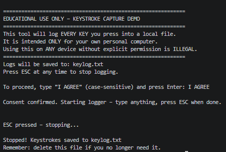
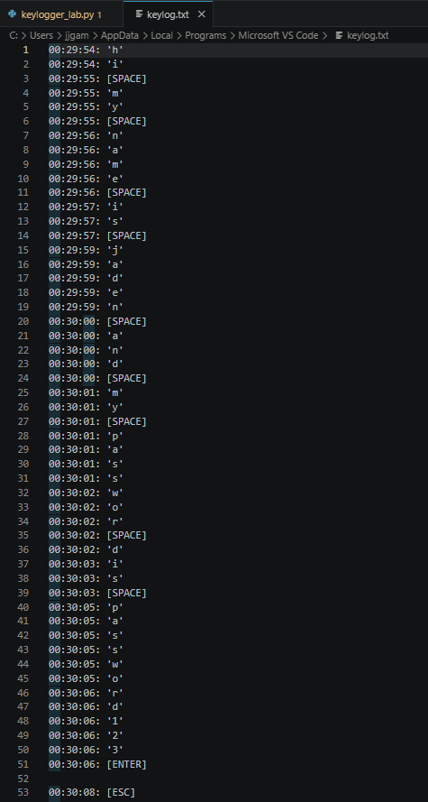

# Educational Keylogger Lab

## Overview

This project is a simple keylogger built with Python and the `pynput` library. The script captures keystrokes, adds timestamps, formats special keys for readability, and logs everything to a text file.

The purpose of this project is to demonstrate keyboard event handling, file I/O, and ethical safeguards in a controlled, local-only environment.

## Project Objective

The objective of this lab was to create a safe, educational keylogger that:

- Captures every key press
- Adds a timestamp to each keystroke
- Converts special keys (`space`, `enter`, `backspace`, etc.) into human‑readable tags
- Writes keystrokes to a log file
- Stops cleanly when the **ESC** key is pressed
- Requires explicit user consent before logging begins
- Includes clear ethical disclaimers

## Tools Used

- Python
- `pynput` library
- Visual Studio Code
- Windows / macOS / Linux (local machine only)

## How It Works

The script uses `pynput.keyboard.Listener` to monitor global keyboard events. Every time a key is pressed, the `on_press` function is called. It gets the current time, formats the key using `format_key()`, and appends the entry to `keylog.txt`.

Special keys are converted to readable tags like `[SPACE]` or `[ENTER]` so the log is easy to understand. The `format_key()` function includes a `try/except` block to handle exotic keys (media keys, function keys) without crashing.

The listener stops when the ESC key is released, thanks to the `on_release` function returning `False`.

Before any logging starts, the script displays a prominent warning and requires the user to type `"I AGREE"` to confirm they understand and accept the ethical restrictions.

## Screenshots

### Keylogger Source Code



*The Python script showing import statements, the `format_key()` function, the consent prompt, and the listener setup with ethical disclaimers.*

### Running the Keylogger



*Terminal output after starting the script. The disclaimer, consent prompt, and confirmation message are visible.*

### Sample Log File Output



*A portion of `keylog.txt` showing timestamped keystrokes, spaces as `[SPACE]`, and the ENTER key as `[ENTER]` followed by a newline.*

## Example Output

When the user types `hi my name is jaden` and then presses ENTER, the log file contains:

```text
00:29:54: 'h'
00:29:54: 'i'
00:29:55: [SPACE]
00:29:55: 'm'
00:29:55: 'y'
00:29:56: [SPACE]
00:29:56: 'n'
00:29:56: 'a'
00:29:56: 'm'
00:29:56: 'e'
00:29:56: [SPACE]
00:29:57: 'i'
00:29:57: 's'
00:29:57: [SPACE]
00:29:57: 'j'
00:29:57: 'a'
00:29:57: 'd'
00:29:57: 'e'
00:29:57: 'n'
00:30:00: [SPACE]
00:30:06: [ENTER]
```

What I Learned

Through this project, I learned how to:

- Capture global keyboard events using pynput
- Handle both regular characters and special keys
- Format output for readability (e.g., [SPACE] instead of Key.space)
- Prevent crashes from unexpected key types using try/except
- Write to a file with timestamps and UTF‑8 encoding
- Implement a clean, intentional kill switch (ESC) for safety
- Add interactive user consent to enforce ethical use

Furthermore, this lab reinforced my understanding of why ethical disclaimers, consent prompts, and strict local‑only use are critical when working with sensitive capabilities like keylogging.
